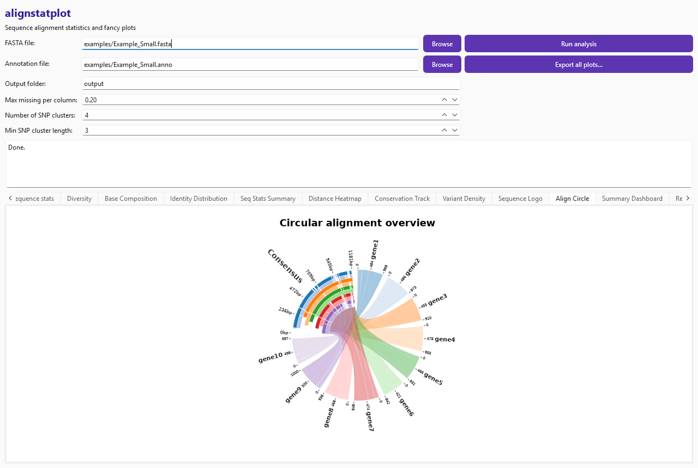
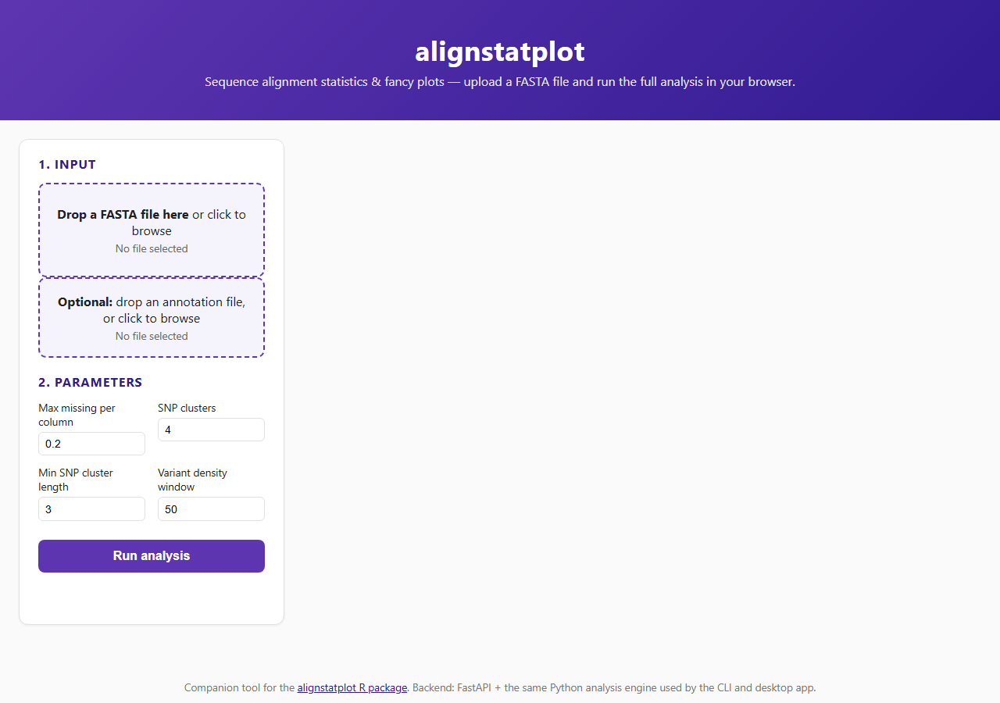
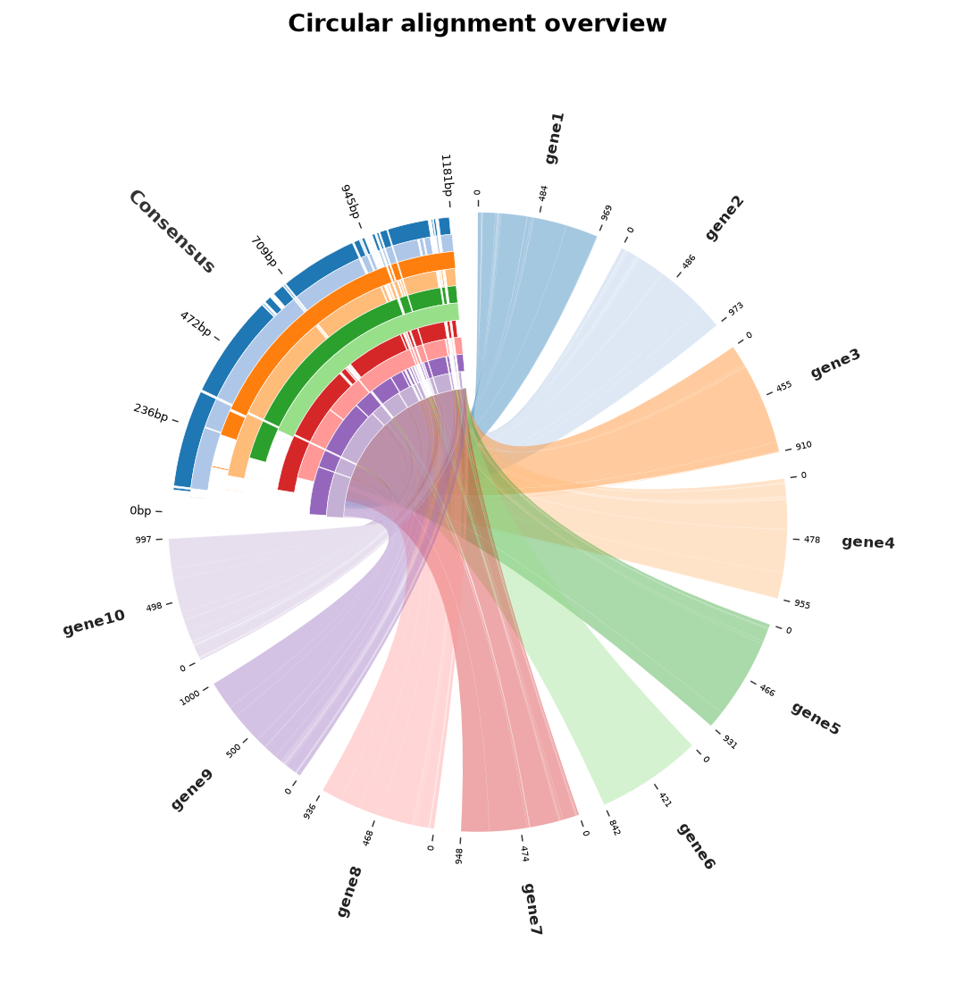

<p align="center">
  
</p>

# alignstatplot-py

Sequence alignment statistics and fancy plots — a Python port and standalone-app
companion to the R package [`alignstatplot`](https://github.com/AlsammanAlsamman/alignstatplot).

It reimplements the same categories of analysis (per-sequence stats, nucleotide
diversity, distance/phylogenetic trees, PCA-based SNP clustering, and the
package's signature circular/dashboard plots) on top of Python-native
scientific libraries (NumPy, pandas, SciPy, scikit-learn, Biopython,
Matplotlib) — no R installation required — and ships three ways to use it:

1. **A library + CLI**, installable from PyPI.
2. **A desktop GUI** (PySide6/Qt) — pick a FASTA file, click Run, browse plots.
3. **A local web GUI** (FastAPI backend + a small HTML/CSS/JS frontend) — drag
   and drop a FASTA file in your browser and get the same results.

All three front ends call the exact same analysis pipeline
(`alignstatplot_py.pipeline.run_pipeline`), so the CLI, desktop app, and web
app always agree with each other bit-for-bit. See
[Result parity with the R package](#result-parity-with-the-r-package) below
for how this Python engine compares numerically to the original R code.

## Screenshots

| Desktop GUI | Web GUI |
| --- | --- |
|  |  |

The circular alignment plot, standalone:



## Install

**No Python? Windows only:** download `alignstatplot-gui.exe` from the
[latest release](https://github.com/AlsammanAlsamman/alignstatplotPy/releases/latest)
and run it directly — no install step at all.

**Python users:**

```bash
pip install alignstatplot-py            # library + CLI only
pip install "alignstatplot-py[gui]"     # + desktop Qt GUI
pip install "alignstatplot-py[web]"     # + local web GUI
pip install "alignstatplot-py[all]"     # everything
```

(Not on PyPI yet in your environment? Install from source: see
[Development](#development) below.)

## Quickstart: CLI

```bash
alignstatplot run \
  --fasta examples/Example_Small.fasta \
  --anno examples/Example_Small.anno \
  --outdir output
```

This writes an `alignment.fasta`, `sequence_stats.csv`, `diversity_stats.csv`,
`distance_matrix.csv`, `snp_impact.csv`, and a `plots/` folder of PNGs to
`output/`.

## Quickstart: desktop GUI

Windows, no Python installed: download and run `alignstatplot-gui.exe` from
the [latest release](https://github.com/AlsammanAlsamman/alignstatplotPy/releases/latest).

Otherwise:

```bash
pip install "alignstatplot-py[gui]"
alignstatplot gui
```

Pick a FASTA file (and optionally an annotation file), tune the parameters,
click **Run analysis**, and browse results in the tabs — each plot is a live
Matplotlib canvas, and **Export all plots...** saves everything to a folder
you choose.

## Quickstart: web GUI

```bash
pip install "alignstatplot-py[web]"
alignstatplot web
```

Opens `http://127.0.0.1:8765` in your browser. Drag a FASTA file onto the
dropzone, optionally add an annotation file, set parameters, and click **Run
analysis**. The frontend's source lives in [`frontend/`](frontend) (plain
HTML/CSS/JS, no build step, published on npm as
[`alignstatplot-web-gui`](https://www.npmjs.com/package/alignstatplot-web-gui)
for anyone who wants to embed or customise it) and is also bundled straight
into the Python package, so `alignstatplot web` needs nothing besides Python.

## Library usage

```python
from alignstatplot_py import run_pipeline

result = run_pipeline(
    fasta_path="examples/Example_Small.fasta",
    anno_path="examples/Example_Small.anno",
    outdir="output",
    max_miss_per=0.2,
    n_clusters=4,
)

result.stats_df          # per-sequence stats (length, A/T/C/G, GC%, gap%)
result.diversity_df      # segregating sites, nucleotide diversity, Watterson's theta, Ts/Tv
result.dist_df           # pairwise distance matrix
result.cluster_result    # PCA + hierarchical SNP clustering
result.impact_df         # per-SNP impact score (for high-impact SNP filtering)
result.figures           # {name: matplotlib.figure.Figure}, e.g. result.figures["align_circle"]
```

## What's implemented

| Category                    | Function(s)                                                          |
| ---------------------------- | --------------------------------------------------------------------- |
| I/O                          | `io_utils.read_fasta`, `read_annotation`                              |
| Alignment                    | `align.align_sequences` (built-in progressive aligner)                |
| Per-sequence stats           | `stats.per_sequence_stats`                                            |
| Nucleotide table & frequency | `nucleotide.alignment_to_table`, `nuc_table_filter`, `nuc_frequency`  |
| Population genetics          | `diversity.diversity_stats`, `position_conservation`, `region_stats`  |
| Distance & trees             | `distance.distance_matrix`, `tree.build_tree` (neighbour-joining)     |
| SNP clustering               | `cluster.snp_cluster`, `snp_cluster_impact`, `filter_high_impact_snps`|
| Plots                        | base composition, identity distribution, seq-stats summary, distance heatmap, conservation track, variant density, region stats, PCA, SNP cluster dendrogram/PCA map/impact, sequence logo, **circular alignment plot**, composite summary dashboard |

## Result parity with the R package

The R package calls out to ClustalW/Clustal Omega/MUSCLE for alignment and to
CRAN packages (`FactoMineR`, `ape`, ...) for PCA/MCA and tree-building.
`alignstatplot-py` reimplements the same *categories* of statistics and plots
using Python-native equivalents (a built-in progressive aligner, scikit-learn
PCA, SciPy hierarchical clustering, Biopython neighbour-joining) so results
match closely but are **not bit-identical** to R — e.g. FactoMineR's MCA and
ape's NJ implementation differ numerically from scikit-learn/SciPy at the
level of floating-point ties and tie-breaking order. If you need results
identical to R down to the last digit, use the R package directly, or drive
it from Python via `rpy2`.

## Development

```bash
git clone https://github.com/AlsammanAlsamman/alignstatplotPy.git
cd alignstatplotPy
pip install -e ".[dev,gui,web]"
pytest
```

### Building distributions

```bash
python -m build          # builds sdist + wheel into dist/
twine check dist/*
twine upload dist/*       # requires your own PyPI credentials
```

```bash
cd frontend
npm publish               # requires your own npm credentials
```

## Repository layout

```
src/alignstatplot_py/   Python package (engine, CLI, Qt GUI, FastAPI web backend)
frontend/                Web GUI source (published separately to npm)
packaging/               PyInstaller entry point for the standalone .exe
examples/                Example FASTA/annotation files (shared with the R package)
tests/                   pytest suite
```

### Building the standalone .exe yourself

Pushing a `v*` tag runs [`.github/workflows/release.yml`](.github/workflows/release.yml),
which builds `alignstatplot-gui.exe` on `windows-latest` and attaches it to
a GitHub Release automatically. To build it locally instead:

```bash
pip install -e ".[gui]" pyinstaller
pyinstaller --onefile --windowed --name alignstatplot-gui \
  --collect-all alignstatplot_py \
  --hidden-import matplotlib.backends.backend_qtagg \
  packaging/alignstatplot_gui.py
# -> dist/alignstatplot-gui.exe
```

## License

GPL-3.0-or-later, matching the R package.

## Citation

If you use this software, please cite the original AlignStatPlot paper,
which describes the methodology this package reimplements:

> Alsamman, A.M., El Allali, A., Mokhtar, M.M., Al-Sham'aa, K., Nassar, A.E.,
> Mousa, K.H. and Kehel, Z., 2023. AlignStatPlot: An R package and online
> tool for robust sequence alignment statistics and innovative visualization
> of big data. *PLoS ONE*, 18(9), p.e0291204.
> https://doi.org/10.1371/journal.pone.0291204

A machine-readable [`CITATION.cff`](CITATION.cff) is included for GitHub's
"Cite this repository" button, covering both the paper above and this
Python/CLI/GUI port specifically.

## See also

- [`alignstatplot`](https://github.com/AlsammanAlsamman/alignstatplot) — the
  original R package this is a companion to.
